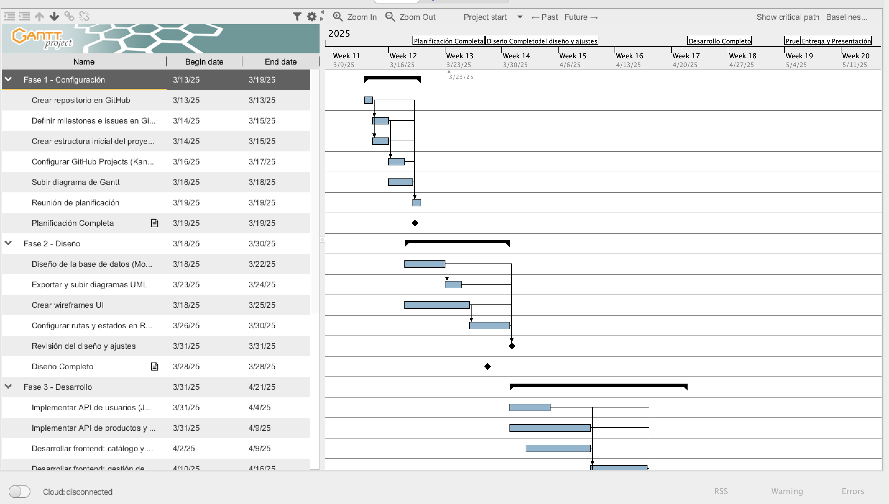
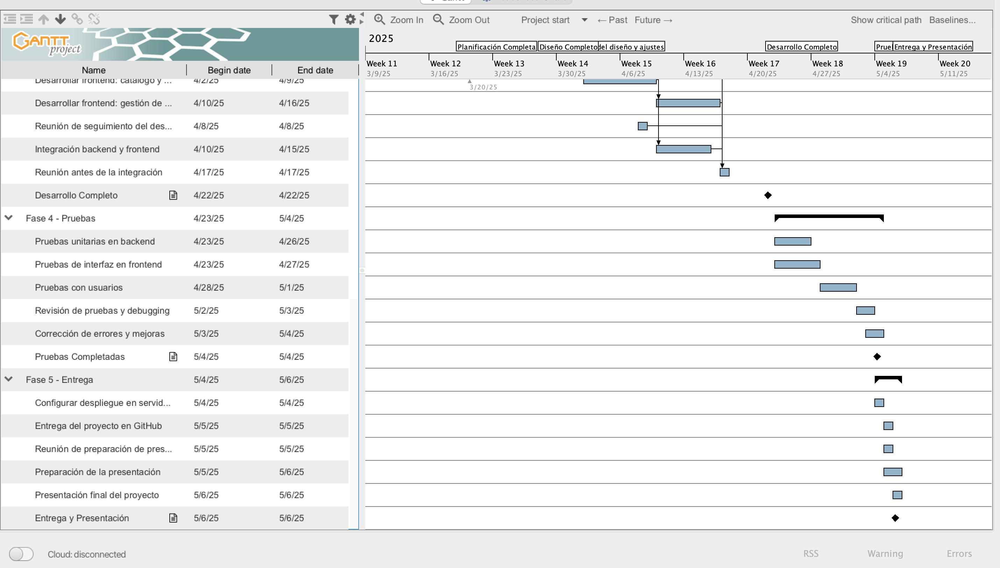

# Tienda Productos Domicilio 🛒

Plataforma de tienda en línea para la venta de productos a domicilio.

## 🚀 Requisitos Previos

Antes de comenzar, asegúrate de tener instalado lo siguiente:

* [Node.js](https://nodejs.org/) (v18 o superior)
* npm (incluido con Node.js)
* Git
* Un editor de código a elección de cada miembro
  
## 🔧 Instalación y Configuración

### Clonar el Repositorio

    git clone https://github.com/MarcosVivas16/Tienda-Productos-Domicilio.git
    cd Tienda-Productos-Domicilio

### Instalar Dependencias

    npm install

### Ejecutar la Aplicación en Modo Desarrollo

    npm start

La aplicación estará disponible en: [http://localhost:3000](http://localhost:3000)

## 🤝 Contribución

1. Haz un fork del repositorio

2. Crea una nueva rama antes de hacer cambios
    ```bash 
    git checkout -b nombre-de-la-rama
3. Realiza tus cambios y haz commit
    ```bash
    git add .
    git commit -m "Descripción del cambio"
4. Sube tus cambios a GitHub
    ```bash
    git push origin nombre-de-la-rama
5. Abre un Pull Request para revisión
  
## ⏳ Planificación

Puedes ver el cronograma del proyecto aquí: [Cronograma](/docs/cronograma.md)

## 👥 Roles

| Rol                   | Responsable                   | 
|-----------------------|-------------------------------|
| Project Manager & QA  | Marcos Vivas                  | 
| UX Manager            | Marcos Vivas                  | 
| System Analyst        | Hatim Bajji                   |
| Full Stack Architect  | Hatim Bajji, Diego Vallespín  |
| Database Manager      | Hatim Bajji                   |
| Technology Specialist | Diego Vallespín               |


## 📅 Planificación del Proyecto - Diagrama de Gantt

A continuación se muestra el diagrama de Gantt dividido en dos partes para una mejor visualización.

### **🔹 Parte 1: Inicio del Proyecto, Configuración y Diseño**


### **🔹 Parte 2: Desarrollo, Pruebas y Entrega**

