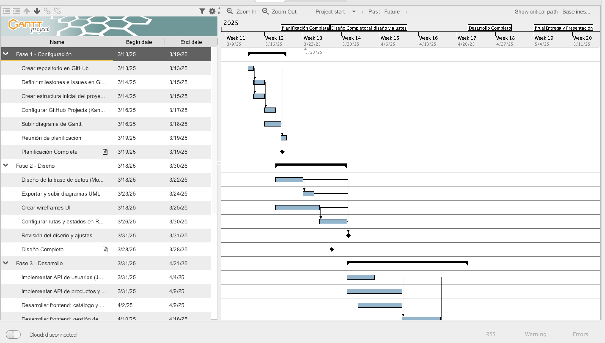
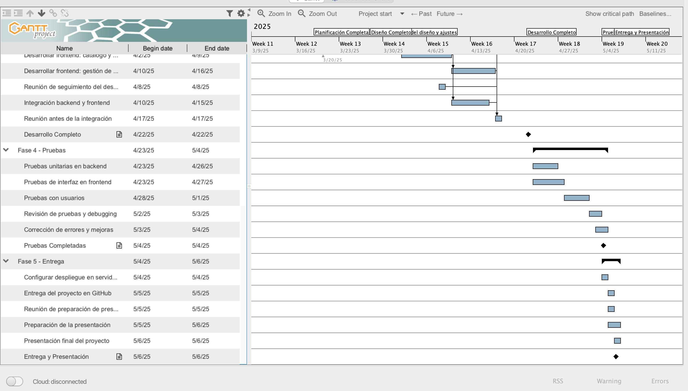
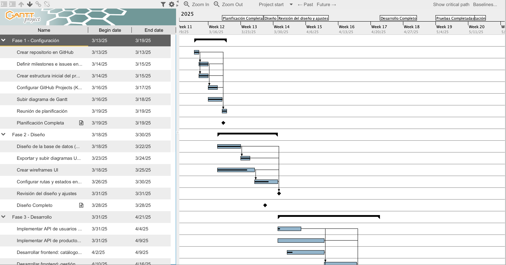
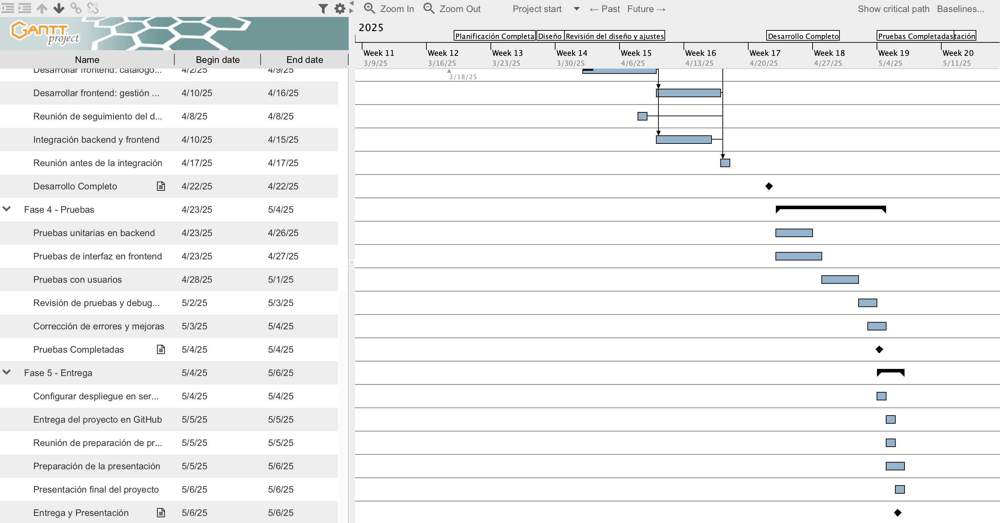
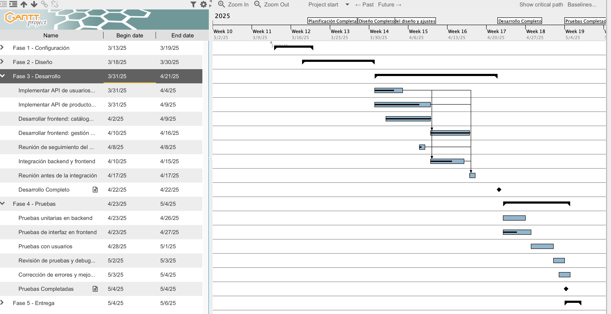
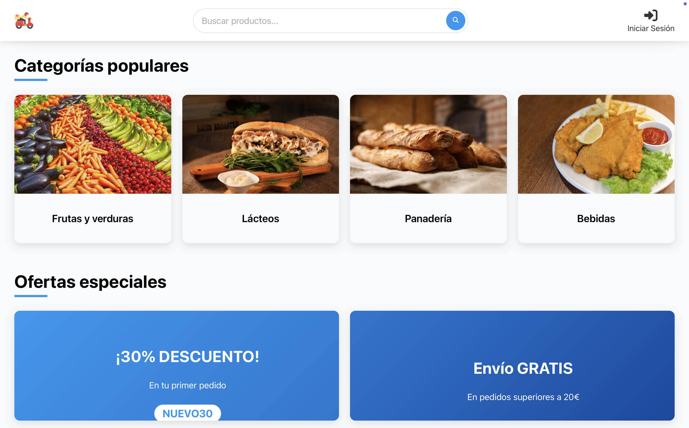
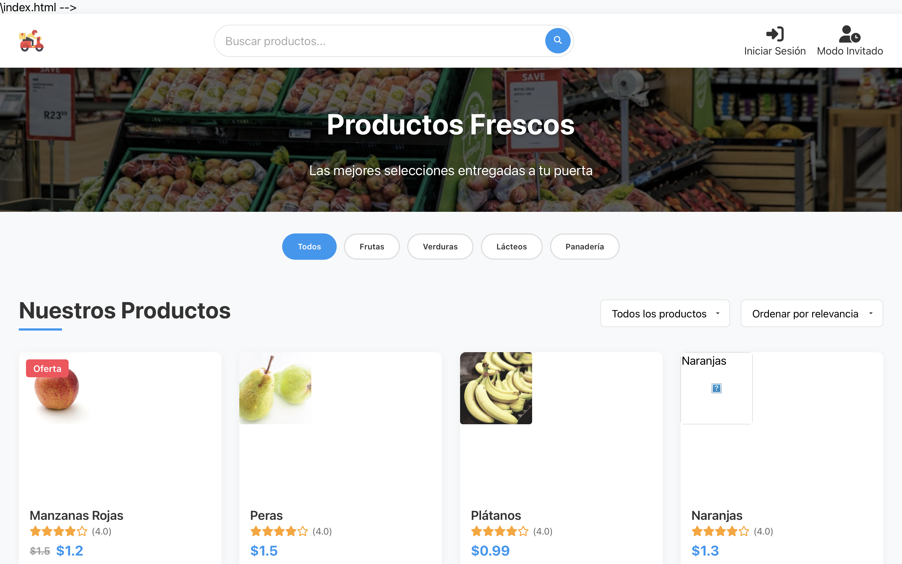
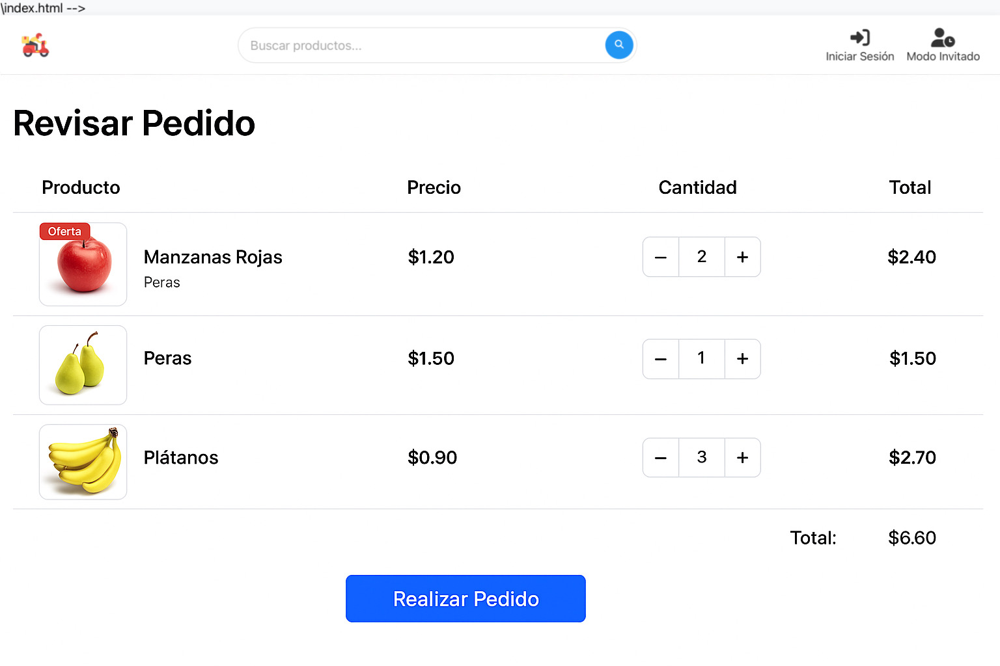
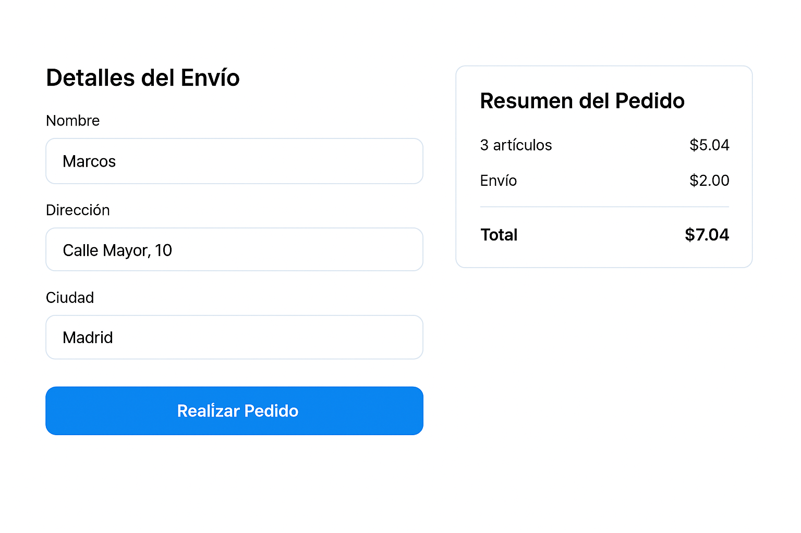
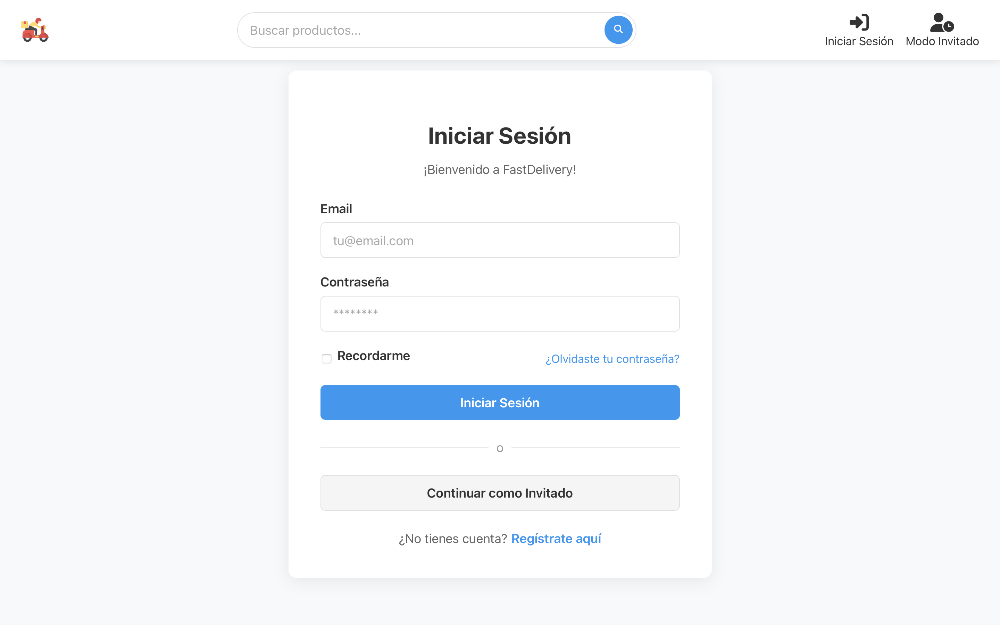

# Tienda Productos Domicilio 🛒

Este es un proyecto base en React para nuestra tienda en línea de productos a domicilio.

## 🚀 Requisitos Previos

Antes de comenzar, asegúrate de tener instalado lo siguiente:

* [Node.js](https://nodejs.org/) (v18 o superior)
* npm (incluido con Node.js)
* Git
* Un editor de código a elección de cada miembro
  

## 🔧 Instalación y Configuración

### Clonar el Repositorio

    git clone https://github.com/MarcosVivas16/Tienda-Productos-Domicilio.git
    cd Tienda-Productos-Domicilio

### Instalar Dependencias

    npm install

### Ejecutar la Aplicación en Modo Desarrollo

    npm start

La aplicación estará disponible en: [http://localhost:3000](http://localhost:3000)

## 🤝 Contribución

1. Haz un fork del repositorio

2. Crea una nueva rama antes de hacer cambios
    ```bash 
    git checkout -b nombre-de-la-rama
3. Realiza tus cambios y haz commit
    ```bash
    git add .
    git commit -m "Descripción del cambio"
4. Sube tus cambios a GitHub
    ```bash
    git push origin nombre-de-la-rama
5. Abre un Pull Request para revisión
  
## ⏳ Planificación

[Cronograma](/docs/cronograma.md)

## 👥 Roles

## 🗓️ Calendario de Prototipos

## 📅 Planificación del Proyecto - Diagrama de Gantt

A continuación se muestra el diagrama de Gantt dividido en dos partes para una mejor visualización.

### **🔹 Parte 1: Inicio del Proyecto, Configuración y Diseño**


### **🔹 Parte 2: Desarrollo, Pruebas y Entrega**


---

## 📅 Diagrama de Gantt (Actualizado a 7 de abril de 2025)

A continuación se muestra el avance real del proyecto en dos partes:

### 🔹 Parte 1 – Planificación y Diseño


### 🔹 Parte 2 – Desarrollo, Pruebas y Entrega


---

## 📅 Diagrama de Gantt (Actualizado a 21 de abril de 2025)

A continuación se muestra el avance real del proyecto:
### 🔹 Desarrollo, Pruebas y Entrega


---

## 📸 Diseño de la Aplicación

### 🏠 Página de Inicio


### 📦 Categorías Populares y Ofertas


### 🛍️ Listado de Productos


### 🧾 Revisión del Pedido


### 📬 Formulario de Envío


### 🔐 Iniciar Sesión



