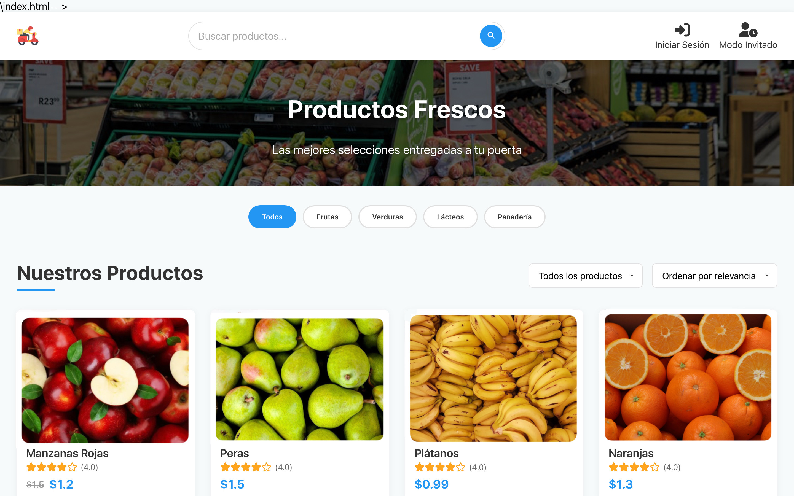

# Tienda Productos Domicilio 🛒

Plataforma de tienda en línea para la venta de productos a domicilio.

## 🚀 Requisitos Previos

Antes de comenzar, asegúrate de tener instalado lo siguiente:

* [Node.js](https://nodejs.org/) (v18 o superior)
* npm (incluido con Node.js)
* Git
* Un editor de código a elección de cada miembro
  
## 🔧 Instalación y Configuración

### Clonar el Repositorio

    git clone https://github.com/MarcosVivas16/Tienda-Productos-Domicilio.git
    cd Tienda-Productos-Domicilio

### Instalar Dependencias

    npm install

### Ejecutar la Aplicación en Modo Desarrollo

    npm start

La aplicación estará disponible en: [http://localhost:3000](http://localhost:3000)

## 🤝 Contribución

1. Haz un fork del repositorio

2. Crea una nueva rama antes de hacer cambios
    ```bash 
    git checkout -b nombre-de-la-rama
3. Realiza tus cambios y haz commit
    ```bash
    git add .
    git commit -m "Descripción del cambio"
4. Sube tus cambios a GitHub
    ```bash
    git push origin nombre-de-la-rama
5. Abre un Pull Request para revisión
  
## ⏳ Planificación

Puedes ver el cronograma del proyecto aquí: [Cronograma](/docs/cronograma.md)

## 👥 Roles

| Nombre             | Rol principal                                                                 |
|--------------------|-------------------------------------------------------------------------------|
| **Hatim Bajji**    | Diseño de prototipos (Figma), planificación (Gantt, milestones, GitHub), desarrollo de la API REST |
| **Marcos Vivas**   | Desarrollo frontend (React), diseño de la interfaz (UI), experiencia de usuario (UX) |
| **Diego Vallespín**| Conexión con base de datos (MySQL), lógica de negocio, modelos y backend persistente |

> La integración del proyecto, así como la ejecución y validación final de los distintos módulos, fue realizada entre todos los miembros del equipo de forma coordinada.

## 🗓️ Calendario de Prototipos
| Fecha         | Prototipo                                 | Objetivo                                   | Responsable     |
|---------------|-------------------------------------------|--------------------------------------------|-----------------|
| **18 marzo**  | Prototipo inicial estático (HTML/CSS)     | Estructura base de la interfaz             | Marcos           |
| **20 marzo**  | Prototipo con navegación simulada         | Flujo visual entre pantallas               | Marcos + Hatim  |
| **22 marzo**  | Prototipo interactivo con datos simulados | Interacción y lógica básica                | Diego  |
| **23 marzo**  | Validación del prototipo con equipo       | Feedback conjunto y ajustes finales        | Todo el equipo  |

## 📅 Planificación del Proyecto - Diagrama de Gantt

A continuación se muestra el diagrama de Gantt dividido en dos partes para una mejor visualización.

### **🔹 Parte 1: Inicio del Proyecto, Configuración y Diseño**


### **🔹 Parte 2: Desarrollo, Pruebas y Entrega**


---

## 📅 Diagrama de Gantt (Actualizado a 7 de abril de 2025)

A continuación se muestra el avance real del proyecto en dos partes:

### 🔹 Parte 1 – Planificación y Diseño


### 🔹 Parte 2 – Desarrollo, Pruebas y Entrega


---

## 📅 Diagrama de Gantt (Actualizado a 21 de abril de 2025)

A continuación se muestra el avance real del proyecto:
### 🔹 Desarrollo, Pruebas y Entrega


---

## 📸 Diseño de la Aplicación

### 🏠 Página de Inicio


### 📦 Categorías Populares y Ofertas


### 🛍️ Listado de Productos


### 🧾 Revisión del Pedido


### 📬 Formulario de Envío


### 🔐 Iniciar Sesión


